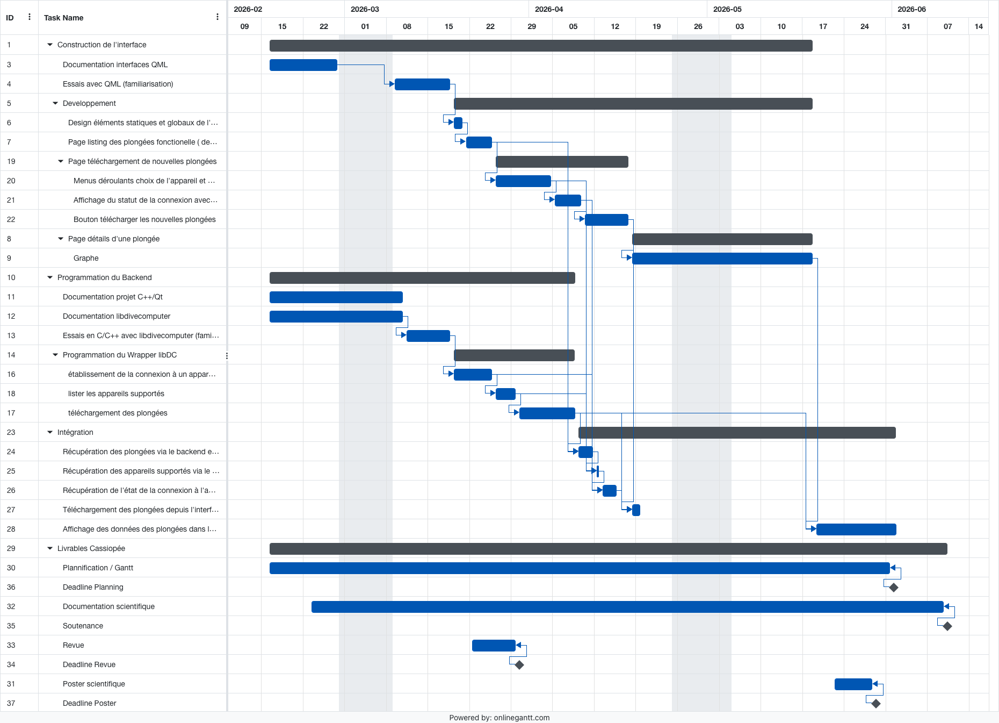
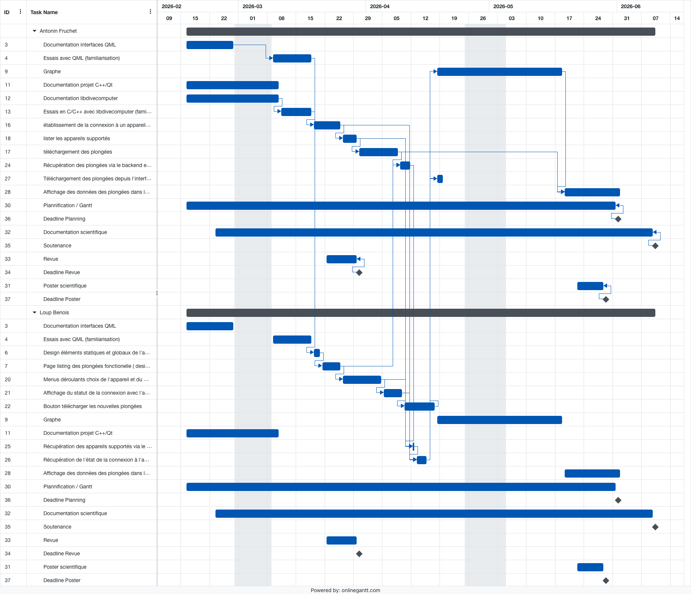

  

# Projet Cassiopée DiveMonitor (2026)

* Membres du Projet : BENOIS Loup, FRUCHET Antonin
* Coordinateur : TAILLANDIER-LOIZE Thierry

## Présentation du projet

DiveMonitor est une application mobile de suivi de plongées développée avec Qt/QML et C++. L'objectif du projet est de permettre à un plongeur d'importer les données de son ordinateur de plongée, de les enregistrer localement, puis de les consulter dans une interface simple avec liste, détails et visualisation graphique.

Le projet s'appuie sur `libdivecomputer` pour communiquer avec les ordinateurs de plongée compatibles et parser les données récupérées. Les plongées importées sont stockées dans une base SQLite locale afin de pouvoir être consultées hors connexion. L'application gère notamment les métadonnées de plongée, les points temporels profondeur/température, ainsi que les fingerprints permettant d'éviter de réimporter des plongées déjà présentes.

## Releases

Les version releases sont disponibles sous forme d'apk dans le dossier [release](release). (L'application passe les tests de sécurité de Google Play)

## Fonctionnalités principales

* Sélection d'un ordinateur de plongée compatible.
* Connexion à un appareil via les modes de transport exposés par `libdivecomputer`.
* Import asynchrone des plongées pour ne pas bloquer l'interface.
* Stockage local des plongées dans une base SQLite.
* Liste des plongées sauvegardées.
* Page de détails avec durée, profondeur maximale, profondeur moyenne, températures et pression atmosphérique.
* Graphique de plongée permettant de visualiser l'évolution des données pendant la plongée.

## Répartition du travail

* Interface utilisateur : BENOIS Loup
* Backend, import des données, intégration `libdivecomputer` et base de données : FRUCHET Antonin

### Planning Projet :

### Planning par personne :

## Architecture

Le projet est organisé autour de deux parties principales :

* `diveMonitorApp/qml/` : interface graphique de l'application, pages, composants et navigation.
* `diveMonitorApp/src/` : logique C++ exposée à QML, import depuis les ordinateurs de plongée, modèles Qt et persistance locale.

Les classes backend principales sont :

* `DiveComputerWrapper` : wrapper autour de `libdivecomputer`, responsable de la détection des appareils, de la connexion, de l'import et du parsing des plongées.
* `DiveDatabase` : couche de persistance SQLite pour enregistrer les plongées, leurs points de mesure et les fingerprints.
* `DiveListModel` et `SampleModel` : modèles Qt utilisés par l'interface QML pour afficher les plongées et leurs données.
